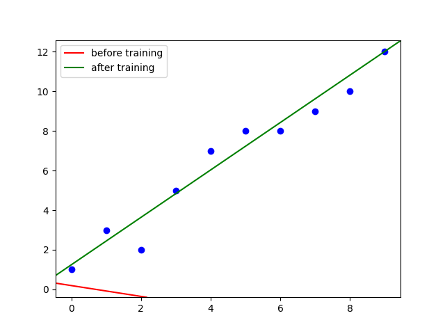

# autodiff


Toy implementaion of automatic differentiation for learning purpose

## Setup

* Prepare env

```bash
pipenv sync --dev
```

* Run tests

```bash
pipenv shell
pytest
```

## Example

```python
"""Linear regression."""
import random
from random import shuffle
from typing import List, Tuple
import matplotlib.pyplot as plt
from autodiff.graph import Var

LEARNING_RATE = 0.005
MINIBATCH_COUNT = 3

w = Var("w")
x = Var("x")
b = Var("b")
y = Var("y")

# model
f = w*x+b
# loss
l = (y-f)**2.0

print("f...")
f.print()
print("l...")
l.print()

# initialize weights
w_start = random.uniform(-0.3, 0.3) # nosec
b_start = random.uniform(-0.3, 0.3) # nosec
w.assign(w_start) # nosec
b.assign(b_start) # nosec

# training data
xs = [0, 1, 2, 3, 4, 5, 6, 7, 8, 9]
ys = [1, 3, 2, 5, 7, 8, 8, 9, 10, 12]
data: List[Tuple[float, float]] \
    = list(zip(xs, ys))

# sgd
for epoch in range(10):
    grads_w = 0.0
    grads_b = 0.0
    for x_data, y_data in random.sample(data, MINIBATCH_COUNT):
        x.assign(x_data)
        y.assign(y_data)
        l.backward()
        grads_w += w.grad()
        grads_b += b.grad()
    w.assign(w.value() - LEARNING_RATE * grads_w/MINIBATCH_COUNT)
    b.assign(b.value() - LEARNING_RATE * grads_b/MINIBATCH_COUNT)
    # print(f'w={w.value()} b={b.value()}')

# eval
print(f'estimates: w={w.value()} b={b.value()}')
for x_data, y_data in data:
    x.assign(x_data)
    y.assign(y_data)
    print(f'x={x_data}, y={y_data}, est={f.value()}')

# plot
fig, ax = plt.subplots()
ax.axline((0, b_start), slope=w_start, color='red', label='before training')
ax.axline((0, b.value()), slope=w.value(), color='green', label='after training')
ax.scatter(xs, ys, color="blue")
ax.legend()
plt.show()
```

Output

```bash
f...
+| val=nan grad=nan forward=nan
   *| val=nan grad=nan forward=nan
      w| val=nan grad=nan forward=nan
      x| val=nan grad=nan forward=nan
   b| val=nan grad=nan forward=nan
l...
^| val=nan grad=nan forward=nan
   -| val=nan grad=nan forward=nan
      y| val=nan grad=nan forward=nan
      +| val=nan grad=nan forward=nan
         *| val=nan grad=nan forward=nan
            w| val=nan grad=nan forward=nan
            x| val=nan grad=nan forward=nan
         b| val=nan grad=nan forward=nan
   2.0| val=2.0 grad=nan forward=nan
```


